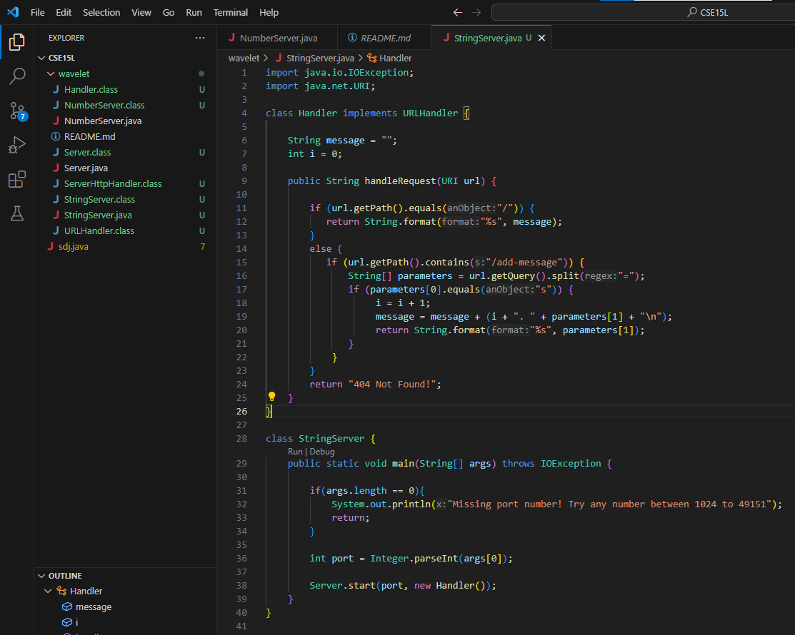
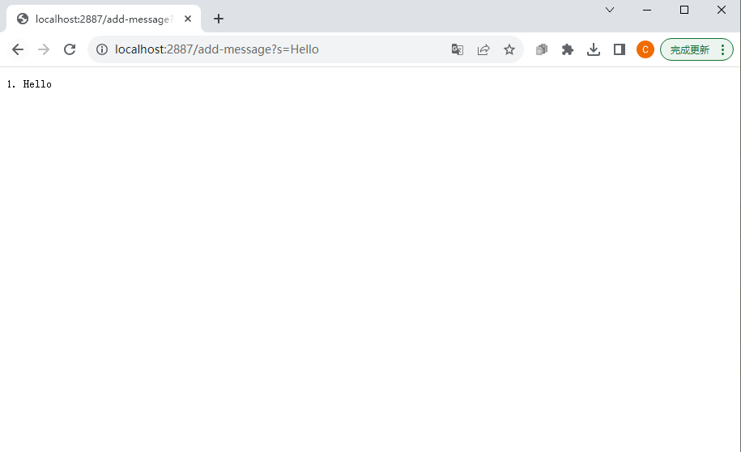
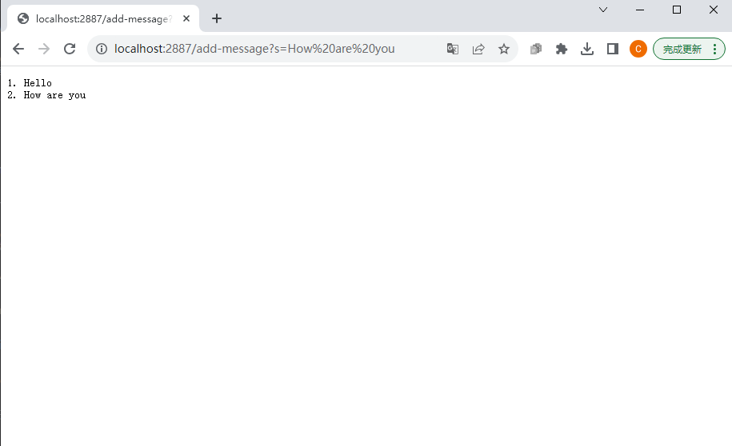

# Part 1: StringSever
The web server StringServer code is shown below in the picture. 

 
 

The two screenshots of using /add-message are shown below in the pictures. 
  
* The method is called in the screenshot is handleRequest(URI url) in Handler class.
* The relevant argument to this method is url. The value of the relevant field message is `string`, and the value of the relevant field `i` is int.
* Before we type in /add-message?s=Hello, the String message is no content, and int i is 0. After we type in /add-message?s=Hello, our i = 0 now adds 1 so it becomes 1, and our message adds new content so it changes from no content to 1. Hello and return to the next line.
 

  
* The method is called in the screenshot is handleRequest(URI url) in Handler class.  
* The relevant argument to this method is url. The value of the relevant field message is `string`, and the value of the relevant field `i` is int.
* Before we type in .add-message?s=How are you, the String message is 1. Hello and return to the next line. Our int i is 1. After we type in /add-message?s=How are you, our i = 1 now adds 1 so it becomes 2, and our message adds new content so it changes from 1. Hello   to  1. Hello 
&emsp; &emsp;&emsp;&emsp; &emsp;&emsp;&emsp;&emsp;&emsp;&emsp;&emsp;&emsp;&emsp;&emsp;&ensp;&emsp;&nbsp;&emsp;&emsp;&emsp;&emsp;&emsp;2. How are you
 
  
