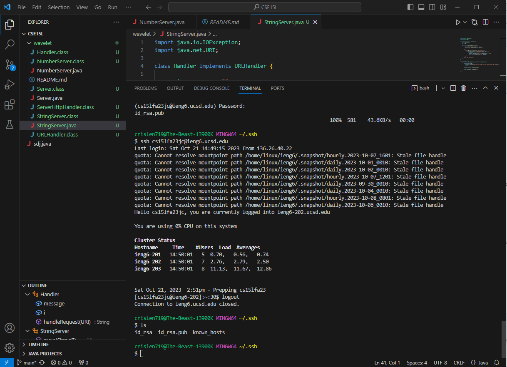
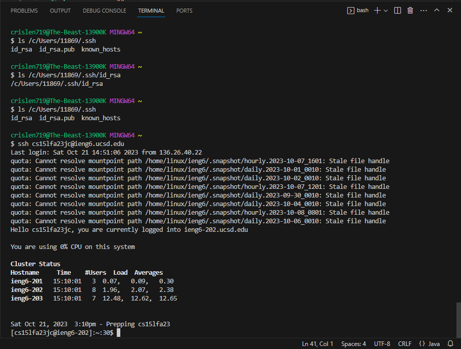

# Part 1: StringSever
The web server StringServer code is shown below in the picture. 

 
 

The two screenshots of using /add-message are shown below in the pictures. 
  
* The method is called in the screenshot is handleRequest(URI url) in Handler class.
* The relevant argument to this method is url. The value of the relevant field message is `string`, and the value of the relevant field `i` is int.
* Before we type in /add-message?s=Hello, the String message is no content, and int i is 0. After we type in /add-message?s=Hello, our i = 0 now adds 1 so it becomes 1, and our message adds new content so it changes from no content to 1. Hello and return to the next line.
 

  
* The method is called in the screenshot is handleRequest(URI url) in Handler class.  
* The relevant argument to this method is url. The value of the relevant field message is `string`, and the value of the relevant field `i` is int.
* Before we type in .add-message?s=How are you, the String message is 1. Hello and return to the next line. Our int i is 1. After we type in /add-message?s=How are you, our i = 1 now adds 1 so it becomes 2, and our message adds new content so it changes from 1. Hello   to  1. Hello    return to next line    2. How are you    return to next line.
 
# Part 2: Show the path of the SSH key
The screenshot of the path to the private and public keys for my SSH key for logging into ieng6 is shown below.
  
The file id_rsa would be our private key, and file id_rsa.pub would be our public key.
 
 
The screenshot of a terminal interaction where I log into ieng6 without being asked for a password is shown below.
  

# Part 3: Conclusion of week2 and week3 lab
In week 2 lab, we learned how to use the terminal to log into the remote desktop and use commands that work on the remote desktop. We learned how to start a server on a remote desktop or our own desktop as the server host. I believe learning how to create and start a web server on my own desktop is important to learn for me, because that is the basic to make a website. In week 3 lab, we learned how to set up the SSH key so we don't need to enter password to log into the server every time. We learned scp command allows copies files or directories between a local and a remote desktop, mkdir command allows user to create directories.
